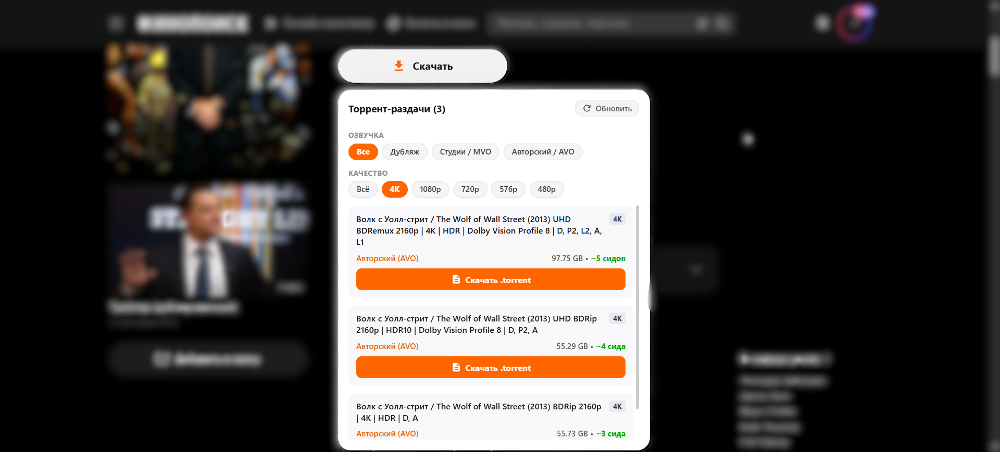
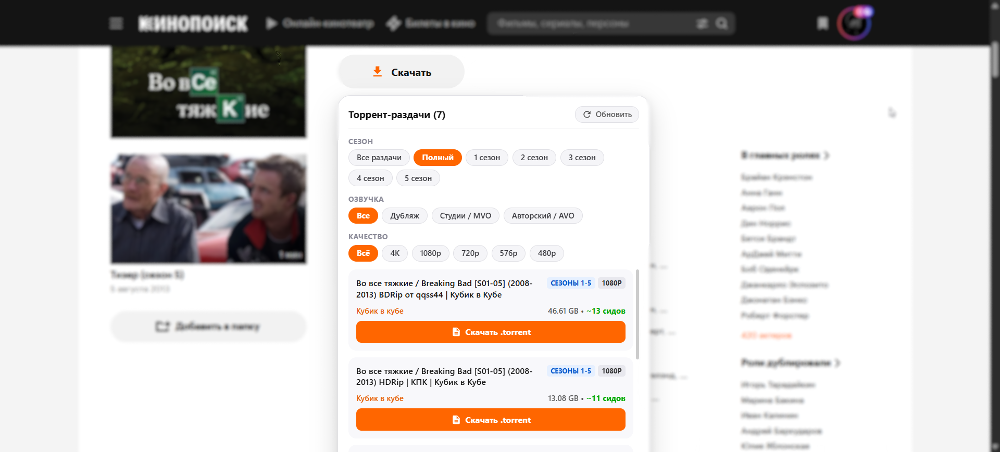

# Kinopoisk Downloader

Браузерное расширение, которое добавляет кнопку «Скачать» прямо на страницы фильмов и сериалов [Кинопоиска](https://www.kinopoisk.ru) для удобного поиска и скачивания торрентов.

### Интерфейс для фильмов

### Интерфейс для сериалов

## Что умеет расширение

- **Поиск торрентов в один клик**: Под основной кнопкой воспроизведения появляется оранжевая кнопка «Скачать». При клике открывается меню со списком доступных раздач прямо на странице Кинопоиска.
- **Фильтр по сезонам**: Выбирайте нужный сезон или скачивайте полный сериал целиком.
- **Фильтры качества и озвучек**: Быстрая сортировка по разрешению (4K, 1080p, 720p, 576p, 480p) и популярным озвучкам (Дубляж, Кубик в кубе, LostFilm и др.).
- **Только живые раздачи**: Мёртвые раздачи без сидов автоматически отсекаются.
- **Быстрое скачивание**: Нажмите «Скачать .torrent» — и файл сразу сохранится на ваш компьютер.

## Как установить

### Шаг 1. Скачайте и распакуйте архив
1. Перейдите в раздел **[Releases](https://github.com/lyosikkk/kinopoisk-downloader/releases)** на GitHub.
2. Скачайте **последнюю версию ZIP-архива** из блока **Assets**.
3. Распакуйте архив в любую удобную папку на компьютере.

### Шаг 2. Включите расширение в браузере
1. Откройте страницу управления расширениями в браузере:
   - В **Google Chrome**: перейдите по адресу `chrome://extensions/`
   - В **Яндекс Браузере**: перейдите по адресу `browser://extensions/`
   - В **Microsoft Edge**: перейдите по адресу `edge://extensions/`
2. Включите **Режим разработчика** (переключатель в правом верхнем углу страницы).
3. Нажмите кнопку **Загрузить распакованное расширение** (Load unpacked) и выберите папку, в которую распаковали архив.

## Как пользоваться

1. Откройте любой фильм или сериал на Кинопоиске.
2. Нажмите оранжевую кнопку **Скачать** под плеером.
3. Выберите подходящую раздачу и нажмите **Скачать .torrent**.
